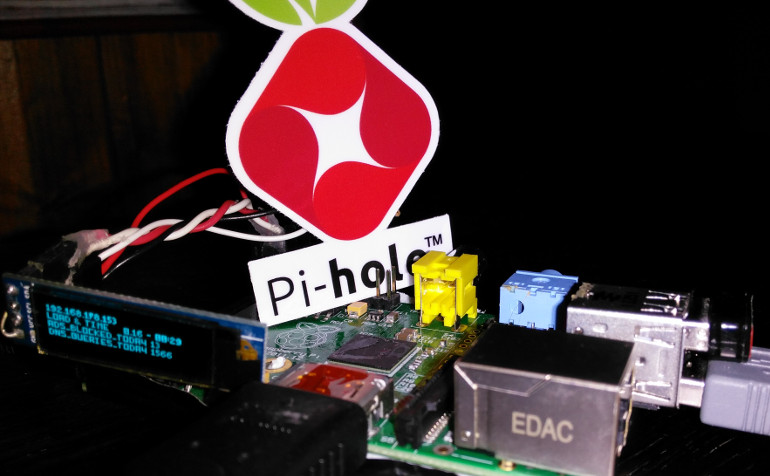

# Raspberry Pi - SSD1306 128x32 OLED Display - C++ Code

This is a fork of the original 128x64 Code by Ken Hughes (2016). I have a 128x32 (4 lines) and not a
128x64 (8 lines) display and modified the code. There are many python examples for the pi and gpio access - BUT I HATE PYTHON and this c++ code is realy good stuff!

I write a small bash script `infos.sh` to show how it works on my pi. The Display shows

- IP address
- CPU load and local time
- some infos about my [pi-hole](https://pi-hole.net/) (API request)

Feel free to add it (every minute) to your crontab!

## Original Readme

### Background

This project was an exercise in reinventing the wheel for the purpose of learning...
There are already a number of libraries that allow you to write to these little 128x64 OLED displays, but that would be too easy (and wouldn't teach us anything), so I decided to write my own.
The article that accompanies this code can be found at [http://pistarter.com/2016/ssd1306-128x64-bit-oled-display-interfacing-with-raspberry-pi/](http://pistarter.com/2016/ssd1306-128x64-bit-oled-display-interfacing-with-raspberry-pi/)

### Features

The current version allows you to instantiate a 'SSD1306' object and use that to send text to the display.Here's a few of the other features:

- **LINE WRAP** - If enabled (off by default) it allows lines of text that are longer than the display can show on one line to wrap onto the next line.
- **SCROLL** - If enabled (on by default) then if a new line of text is to be displayed and the screen is 'full' at the moment then the existing text will scroll up (top line disappears) and the new line will be displayed/appended to the bottom.
- **CLEAR** - Blanks the display, removing all text
- **DISPLAY** - Currently it supports all letters (A-Z), lowercase characters are converted to uppercase. It also supports numbers and the folloing punctuation: !"#$%&'()*+,-./:;<=>?@[\]^_` (and SPACE). Any other characters sent to it will be displayed as a small solid block.
 
### Usage

Use of the code is as simple as including three files in your project: `charmap.h`, `ssd1306.h`, `ssd1306.cpp`. In your own code it is then a case of instantiating a SSD1306 object and using the key functions:

- `initDisplay()` - Does the initialization, sets things up. 
- `setWordWrap(int)` - Configures the word wrap feature (0 = off, -1 = on)
- `setDisplayMode(SSD1306::Mode)` - Configures screen scrolling, or wrapping `SSD1306::Mode::SCROLL` or `SSD1306::Mode::WRAP`
- `textDisplay(const char *message)` - Sends the text to the device for displaying, e.g. `textDisplay("GOOD MORNING !!")`
- `clearDisplay()` - Blanks the whole screen.
 
There is a small sample app (**oled.cpp**) that shows how to instantiate and use the SSD1306 class. When compiled you can use this app to test the device out from the command line:

>   ./oled -ww -t "A line of text" -t "A second line of text" -t "A long line of text that will wrap to the next line" - "Keep adding -t and text (in quotes) to the command line to see it scroll"
